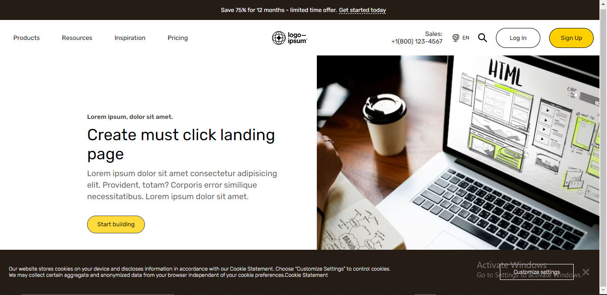

# 1. Explain all the CSS positions(static, fixed, sticky, relative, absolute) with one code example each

1. Static:
The default positioning of an element is static, which means it follows the normal flow of the document. Elements with static positioning are not affected by the top, bottom, left, or right properties.

Example:
```css
<div class="static-example">
  This is a static element.
</div>

<style>
.static-example {
 
}
</style>
```

2. Fixed:
Elements with fixed positioning are positioned relative to the viewport and do not move when the user scrolls the page. They remain in the same position regardless of scrolling.

Example:
```css
<div class="fixed-example">
  This is a fixed element.
</div>

<style>
.fixed-example {
  position: fixed;
  top: 20px;
  right: 20px;
}
</style>
```

3. Sticky:
Sticky positioning is a hybrid of relative and fixed positioning. It behaves like a relatively positioned element until a certain scroll threshold is reached. Once the element reaches that threshold, it becomes fixed to the specified position.

Example:
```css
<div class="sticky-example">
  This is a sticky element.
</div>

<style>
.sticky-example {
  position: sticky;
  top: 50px;
}
</style>
```

4. Relative:
Elements with relative positioning are positioned relative to their normal flow position. They can be adjusted using the top, bottom, left, and right properties, which shift the element from its original position.

Example:
```css
<div class="relative-example">
  This is a relative element.
</div>

<style>
.relative-example {
  position: relative;
  top: 20px;
  left: 20px;
}
</style>
```

5. Absolute:
Elements with absolute positioning are positioned relative to their nearest positioned ancestor or to the initial containing block if there is no positioned ancestor. They are taken out of the normal flow of the document.

Example:
```css
<div class="container">
  <div class="absolute-example">
    This is an absolute element.
  </div>
</div>

<style>
.container {
  position: relative;
  width: 300px;
  height: 200px;
  background-color: lightgray;
}

.absolute-example {
  position: absolute;
  top: 20px;
  left: 20px;
}
</style>
```

# 2. Create a form with basic validation (name, email, phone number, password, age, gender, date, color picker)

## Html
```html
<!DOCTYPE html>
<html lang="en">
<head>
    <meta charset="UTF-8">
    <meta name="viewport" content="width=device-width, initial-scale=1.0">
    <title>Form Validation</title>
</head>
<body>
    <div class="container">
        <div class="successMessage">Validated Successfully.</div>
        <form action="#" class="validate_form" id="validate_form">
            <h1 class="form_title">Validation Form</h1>
            <hr>
            <div class="input_container">
                <span>
                    <label for="name">Name</label>
                    <input type="text" name="name" id="name" placeholder="User fullname...">                
                </span>
    
                <span>
                    <label for="email">Email</label>
                    <input type="email" name="email" id="email" placeholder="User email...">                
                </span>
    
                <span>
                    <label for="phone">Phone</label>
                    <input type="number" name="phone" id="phone" placeholder="User phone number...">                
                </span>
    
                <span>
                    <label for="password">Password</label>
                    <input type="password" name="password" id="password" placeholder="Password">                
                </span>
    
                <span>
                    <label for="confirm_password">Confirm Password</label>
                    <input type="text" name="confirm_password" id="confirm_password" placeholder="Confirm Password">                
                </span>
    
                <span>
                    <label for="age">Age</label>
                    <input type="number" name="age" id="age" placeholder="User age...Ex. 30">                
                </span>
    
                <span>
                    <label for="gender">Gender</label>
                    <select name="gender" id="gender">
                        <option value="choose">Choose</option>
                        <option value="male">Male</option>
                        <option value="female">female</option>
                        <option value="not_disclosed">Prefer not to say</option>
                    </select>                
                </span>
    
                <span>
                    <label for="date">Date</label>
                    <input type="date" name="date" id="date">                
                </span>
    
                <span>
                    <label for="color">Color</label>
                    <input type="color" name="color" id="color">                
                </span>
            </div>

            <button type="submit" class="validate_btn" onclick="validate(event)">Validate</button>
        </form>
    </div>
</body>
</html>
```

## CSS
```css
*{
    padding: 0;
    margin: 0;
}

body{
    width: 100%;
    height: 100%;
    background: #333;
}

.container{
    width: 100vw;
    height: 100vh;
    display: flex;
    align-items: center;
    justify-content: center;
}

.validate_form{
    width: 600px;
    height: max-content;
    padding: 10px;
    border-radius: 10px;
    background: #111;
    color: #ebebeb;

    position: relative;
    top: 0;
    left: 0;
}

.input_container{
    margin-top: 20px;
    display: grid;
    grid-template-columns: 1fr 1fr;
    gap: 0 20px;
}

.form_title{
    margin-bottom: 10px;
}

span{
    width: 100%;
    display: flex;
    flex-direction: column;
}

label{
    margin-bottom: 5px;
    font-size: 18px;
}

input{
    margin-bottom: 10px;
    border: none;
    height: 30px;
    text-indent: 5px;
    outline: none;
    border-radius: 5px;
    border: 2px solid transparent;
}

select{
    margin-bottom: 10px;
    border: none;
    height: 30px;
    text-indent: 5px;
    outline: none;
    border-radius: 5px;
    border: 2px solid transparent;
}

.validate_btn{
    width: 100%;
    height: 40px;
    border: none;
    border-radius: 5px;
    outline: none;
    cursor: pointer;
    font-size: 20px;
    background: cyan;
    color: rgb(0, 0, 0);
    font-weight: 500;
    margin-top: 20px;
}

.successMessage{
    width: max-content;
    padding: 10px 40px;
    border-radius: 5px;
    background: #37ff83;
    font-size: 20px;
    font-weight: 600;
    position: absolute;
    top: 30px;
    right: 30px;
    display: none;
}
```

## Javascript
```javascript
let prev 
const validate = (event) => {
    event.preventDefault()
    prev && (prev.style.border = "2px solid transparent")

    let errorStyle = {
        border: "1px solid red;"
    }

    let form = document.getElementById("validate_form")
    let name = document.getElementById("name")
    let email = document.getElementById("email")
    let phone = document.getElementById("phone")
    let password = document.getElementById("password")
    let confirm_password = document.getElementById("confirm_password")
    let age = document.getElementById("age")
    let gender = document.getElementById("gender")
    let date = document.getElementById("date")
    let color = document.getElementById("color")
    let emailRegEx = new RegExp(/^[a-zA-Z0-9.! #$%&'*+/=? ^_`{|}~-]+@[a-zA-Z0-9-]+(?:\. [a-zA-Z0-9-]+)*$/)
    let successMessage = document.querySelector('.successMessage')

    if(name.value === ''){
        prev = name
        name.style.border = "2px solid red"
        return
    }else if(email.value === '' || emailRegEx.test(email.value)){
        prev = email
        email.style.border = "2px solid red"
        return
    }else if(phone.value === ''){
        prev = phone
        phone.style.border = "2px solid red"
        return
    }else if(password.value !== confirm_password.value || password.value === '' || confirm_password.value === ''){
        prev = password
        password.style.border = "2px solid red"
        return
    }else if(age.value === ''){
        prev = age
        age.style.border = "2px solid red"
        return
    }else if(gender.value === "choose"){
        prev = gender
        gender.style.border = "2px solid red"
        return
    }else if(date.value === ''){
        prev = date
        date.style.border = "2px solid red"
        return
    }else if(color.value === '#000000'){
        prev = color
        color.style.border = "2px solid red"
        return
    }

    successMessage.style.display = "block"

    setTimeout(()=>{
        successMessage.style.display = "none"
    },2000)

    return
}
```

# 4. Create a similar looking website shown in the image

> Output Image



## HTML 
```html
<!DOCTYPE html>
<html lang="en">
<head>
    <meta charset="UTF-8">
    <meta name="viewport" content="width=device-width, initial-scale=1.0">
    <title>Similar Looking Site</title>
    <link rel="preconnect" href="https://fonts.googleapis.com">
    <link rel="preconnect" href="https://fonts.gstatic.com" crossorigin>
    <link href="https://fonts.googleapis.com/css2?family=Rubik:wght@300;400;500;600;700;800&display=swap" rel="stylesheet">
    <link rel="stylesheet" href="style.css">
</head>
<body>
    <div class="promotional">
        Save 75% for 12 months - limited time offer. <a class="promotional_link" href="#"> Get started today</a>
    </div>

    <header class="header">
        <nav class="header_nav">
            <div class="nav_link">Products</div>
            <div class="nav_link">Resources</div>
            <div class="nav_link">Inspiration</div>
            <div class="nav_link">Pricing</div>
        </nav>

        <div class="header_logo">
            <svg id="logo-77" width="80" height="35" viewBox="0 0 105 40" fill="none" xmlns="http://www.w3.org/2000/svg"><path class="ccustom" d="M48.136 35.2381H50.8704V24.9238H48.136V35.2381ZM48.136 23.3153H50.8704V20.8624H48.136V23.3153Z" fill="black"></path><path class="ccustom" d="M52.6323 38.6159H55.3667V34.072H55.407C55.99 34.9566 56.935 35.5397 58.3826 35.5397C61.0366 35.5397 62.8461 33.4286 62.8461 30.091C62.8461 26.874 61.0969 24.6423 58.3625 24.6423C56.9551 24.6423 55.99 25.3058 55.3265 26.2105H55.2662V24.9238H52.6323V38.6159ZM57.7996 33.2677C56.171 33.2677 55.3064 32.0413 55.3064 30.1714C55.3064 28.3217 55.99 26.8539 57.699 26.8539C59.3879 26.8539 60.0715 28.2211 60.0715 30.1714C60.0715 32.1217 59.1869 33.2677 57.7996 33.2677Z" fill="black"></path><path class="ccustom" d="M68.3007 35.5397C70.8742 35.5397 72.6435 34.2931 72.6435 32.2222C72.6435 29.8095 70.7335 29.327 69.0044 28.9651C67.5366 28.6635 66.1694 28.583 66.1694 27.6984C66.1694 26.9545 66.8731 26.5523 67.9388 26.5523C69.1049 26.5523 69.8086 26.9545 69.9292 28.0603H72.4023C72.2012 25.9894 70.6933 24.6423 67.979 24.6423C65.6266 24.6423 63.7768 25.7079 63.7768 27.9396C63.7768 30.1915 65.5864 30.6942 67.4361 31.0561C68.8435 31.3375 70.1504 31.4381 70.1504 32.4233C70.1504 33.1471 69.4668 33.6095 68.2604 33.6095C67.034 33.6095 66.1895 33.0868 66.0086 31.9005H63.4752C63.6361 34.0921 65.3049 35.5397 68.3007 35.5397Z" fill="black"></path><path class="ccustom" d="M83.0252 35.2381V24.9238H80.2908V30.8751C80.2908 32.2423 79.5067 33.2074 78.2199 33.2074C77.0538 33.2074 76.5109 32.5439 76.5109 31.3375V24.9238H73.7966V31.8C73.7966 34.0518 75.0834 35.5196 77.3755 35.5196C78.8231 35.5196 79.6273 34.9767 80.3311 34.0317H80.3914V35.2381H83.0252Z" fill="black"></path><path class="ccustom" d="M84.7939 35.2381H87.5284V29.2465C87.5284 27.8793 88.2723 26.9947 89.3781 26.9947C90.3834 26.9947 90.9665 27.5978 90.9665 28.764V35.2381H93.7009V29.2465C93.7009 27.8793 94.4046 26.9947 95.5506 26.9947C96.5559 26.9947 97.139 27.5978 97.139 28.764V35.2381H99.8734V28.3016C99.8734 26.0497 98.6469 24.6423 96.4755 24.6423C95.1686 24.6423 94.0829 25.3259 93.3792 26.4518H93.339C92.8363 25.3661 91.7908 24.6423 90.4839 24.6423C89.0564 24.6423 88.0511 25.3661 87.4881 26.3111H87.4278V24.9238H84.7939V35.2381Z" fill="black"></path><path class="ccustom" d="M48.1762 17.572H50.9106V3.19629H48.1762V17.572Z" fill="black"></path><path class="ccustom" d="M57.5966 17.8736C60.7935 17.8736 62.985 15.5011 62.985 12.4249C62.985 9.3487 60.7935 6.97621 57.5966 6.97621C54.3998 6.97621 52.2082 9.3487 52.2082 12.4249C52.2082 15.5011 54.3998 17.8736 57.5966 17.8736ZM57.5966 15.7826C55.9077 15.7826 54.9829 14.4355 54.9829 12.4249C54.9829 10.4143 55.9077 9.04712 57.5966 9.04712C59.2654 9.04712 60.2104 10.4143 60.2104 12.4249C60.2104 14.4355 59.2654 15.7826 57.5966 15.7826Z" fill="black"></path><path class="ccustom" d="M68.8 21.0906C70.3281 21.0906 71.6551 20.7287 72.5196 19.9244C73.2836 19.2207 73.7461 18.2355 73.7461 16.7879V7.25769H71.1122V8.34341H71.072C70.4487 7.47885 69.5037 6.97621 68.2169 6.97621C65.6032 6.97621 63.7534 8.94659 63.7534 12.0228C63.7534 15.1392 66.0053 16.9487 68.2974 16.9487C69.6043 16.9487 70.3884 16.426 70.9916 15.7424H71.0519V16.8683C71.0519 18.2757 70.308 19.0196 68.7598 19.0196C67.4931 19.0196 66.9101 18.517 66.6889 17.8736H63.9746C64.2561 19.8842 65.9852 21.0906 68.8 21.0906ZM68.7598 14.7572C67.3524 14.7572 66.4275 13.7318 66.4275 11.9826C66.4275 10.2535 67.3524 9.16775 68.7397 9.16775C70.3884 9.16775 71.1926 10.4545 71.1926 11.9625C71.1926 13.4905 70.4889 14.7572 68.7598 14.7572Z" fill="black"></path><path class="ccustom" d="M80.3925 17.8736C83.5893 17.8736 85.7809 15.5011 85.7809 12.4249C85.7809 9.3487 83.5893 6.97621 80.3925 6.97621C77.1957 6.97621 75.0041 9.3487 75.0041 12.4249C75.0041 15.5011 77.1957 17.8736 80.3925 17.8736ZM80.3925 15.7826C78.7036 15.7826 77.7787 14.4355 77.7787 12.4249C77.7787 10.4143 78.7036 9.04712 80.3925 9.04712C82.0613 9.04712 83.0063 10.4143 83.0063 12.4249C83.0063 14.4355 82.0613 15.7826 80.3925 15.7826Z" fill="black"></path><path class="ccustom" d="M88.1779 13.6313H100V11.2789H88.1779V13.6313Z" fill="black"></path><path class="ccustom" d="M100.867 23.1717C100.867 22.709 101.242 22.3339 101.705 22.3339H103.38C103.843 22.3339 104.218 22.709 104.218 23.1717C104.218 23.6343 103.843 24.0094 103.38 24.0094H101.705C101.242 24.0094 100.867 23.6343 100.867 23.1717Z" fill="black"></path><path class="ccustom" fill-rule="evenodd" clip-rule="evenodd" d="M20.5216 0C31.5673 0 40.5216 8.9543 40.5216 20C40.5216 31.0457 31.5673 40 20.5216 40C9.47591 40 0.521606 31.0457 0.521606 20C0.521606 8.9543 9.47591 0 20.5216 0ZM19.7987 1.49659C17.5171 1.81769 15.3445 3.65108 13.658 6.7174C13.1688 7.60683 12.7274 8.58946 12.3427 9.65044C14.6359 9.07417 17.155 8.73442 19.7987 8.68187V1.49659ZM10.6524 10.1308C11.1307 8.62958 11.7159 7.2484 12.3912 6.02065C13.2272 4.50059 14.2194 3.18795 15.3373 2.17977C9.2584 3.94523 4.46683 8.73679 2.70138 14.8157C3.70955 13.6978 5.0222 12.7056 6.54226 11.8696C7.77001 11.1943 9.15118 10.6091 10.6524 10.1308ZM10.172 11.8211C9.59577 14.1143 9.25603 16.6334 9.20348 19.2771H2.01819C2.3393 16.9954 4.17269 14.8228 7.23901 13.1364C8.12844 12.6472 9.11107 12.2058 10.172 11.8211ZM10.6496 19.2771C10.7093 16.392 11.1246 13.6834 11.8118 11.2902C14.205 10.603 16.9137 10.1876 19.7987 10.1279V13.2508C18.7224 16.0062 16.5272 18.2012 13.7717 19.2771H10.6496ZM9.20348 20.7229H2.01819C2.3393 23.0046 4.17269 25.1771 7.23901 26.8636C8.12844 27.3528 9.11107 27.7942 10.172 28.1789C9.59577 25.8857 9.25603 23.3666 9.20348 20.7229ZM11.8118 28.7098C11.1246 26.3166 10.7093 23.608 10.6496 20.7229H13.7717C16.5272 21.7988 18.7225 23.9938 19.7987 26.7492V29.8721C16.9137 29.8124 14.205 29.397 11.8118 28.7098ZM10.6524 29.8692C9.15118 29.3909 7.77001 28.8057 6.54226 28.1304C5.0222 27.2944 3.70955 26.3022 2.70138 25.1843C4.46683 31.2632 9.2584 36.0548 15.3373 37.8202C14.2194 36.812 13.2272 35.4994 12.3912 33.9793C11.7159 32.7516 11.1307 31.3704 10.6524 29.8692ZM19.7987 38.5034C17.5171 38.1823 15.3445 36.3489 13.658 33.2826C13.1688 32.3932 12.7274 31.4105 12.3427 30.3496C14.6359 30.9258 17.155 31.2656 19.7987 31.3181V38.5034ZM25.7059 37.8202C26.8238 36.812 27.816 35.4994 28.6521 33.9793C29.3273 32.7516 29.9125 31.3704 30.3908 29.8692C31.892 29.3909 33.2732 28.8057 34.501 28.1304C36.021 27.2944 37.3337 26.3022 38.3418 25.1843C36.5764 31.2632 31.7848 36.0548 25.7059 37.8202ZM28.7005 30.3496C28.3158 31.4105 27.8744 32.3932 27.3852 33.2826C25.6988 36.3489 23.5262 38.1823 21.2445 38.5034V31.3181C23.8882 31.2656 26.4073 30.9258 28.7005 30.3496ZM30.8712 28.1789C31.9321 27.7942 32.9148 27.3528 33.8042 26.8636C36.8705 25.1771 38.7039 23.0046 39.025 20.7229H31.8397C31.7872 23.3666 31.4474 25.8857 30.8712 28.1789ZM30.3937 20.7229C30.334 23.608 29.9186 26.3166 29.2314 28.7098C26.8382 29.397 24.1296 29.8124 21.2445 29.8721V26.7515C22.3204 23.9951 24.5161 21.7991 27.2724 20.7229H30.3937ZM31.8397 19.2771H39.025C38.7039 16.9954 36.8705 14.8228 33.8042 13.1364C32.9148 12.6472 31.9321 12.2058 30.8712 11.8211C31.4474 14.1143 31.7872 16.6334 31.8397 19.2771ZM29.2314 11.2902C29.9186 13.6834 30.334 16.392 30.3937 19.2771H27.2724C24.5161 18.2009 22.3204 16.0049 21.2445 13.2485V10.1279C24.1296 10.1876 26.8382 10.603 29.2314 11.2902ZM30.3908 10.1308C31.892 10.6091 33.2732 11.1943 34.501 11.8696C36.021 12.7056 37.3337 13.6978 38.3418 14.8157C36.5764 8.73679 31.7848 3.94523 25.7059 2.17977C26.8238 3.18795 27.816 4.50059 28.6521 6.02065C29.3273 7.2484 29.9125 8.62958 30.3908 10.1308ZM21.2445 1.49659C23.5262 1.81769 25.6988 3.65108 27.3852 6.7174C27.8744 7.60684 28.3158 8.58946 28.7005 9.65044C26.4073 9.07417 23.8882 8.73442 21.2445 8.68187V1.49659Z" fill="black"></path></svg>
        </div>

        <div class="header_contact">
            <a href="#" class="contact_link">
                Sales:
                <span>
                    +1(800) 123-4567 
                </span>
            </a>

            <div class="language">
                
                EN
            </div>

            
        
            <div class="header_auth">
                <button class="header_login">Log In</button>
                <button class="header_login header_signup">Sign Up</button>
            </div>
        </div>
    </header>

    <section class="hero">
        <div class="hero_text">
            <div class="text_sup">Lorem ipsum, dolor sit amet.</div>
            <div class="text_title">Create must click landing page</div>
            <div class="text_summary">Lorem ipsum dolor sit amet consectetur adipisicing elit. Provident, totam? Corporis error similique necessitatibus. Lorem ipsum dolor sit amet.</div>
            <button class="text_cta_btn">
                Start building
            </button>
        </div>
        <div class="hero_img_holder">
            
        </div>
    </section>

    <div class="cookie_consent">
        <div class="consent_text">Our website stores cookies on your device and discloses information in accordance with our Cookie Statement. Choose “Customize Settings” to control cookies. We may collect certain aggregate and anonymized data from your browser independent of your cookie preferences.Cookie Statement</div>
        <div class="cookie_settings">
            <button class="cookie_custom_btn">Customize settings</button>
            <button class="cookie_close_btn"></button>
        </div>
    </div>

    <script>
        document.querySelector('.cookie_close_btn').addEventListener('click',(e)=> {
            document.querySelector('.cookie_consent').style.display = "none"
        })
    </script>
</body>
</html>
```

## CSS

```css
*{
    padding: 0;
    margin: 0;
    font-family: 'Rubik',sans-serif;
}

body{
    width: 100%;
    height: 100%;
    overflow-x: hidden;
}

.promotional{
    width: 100vw;
    height: 45px;
    display: flex;
    align-items: center;
    justify-content: center;
    background: #241c15;
    color: #fff;
    font-size: 13px;
    font-weight: 400;
    position: fixed;
    top: 0;
    left: 0;
}

.promotional_link{
    color: #fff;
    text-decoration: underline dashed;
    text-underline-offset: 3px;
    margin-left: 5px;
}

.header{
    width: 100vw;
    height: 80px;
    display: flex;
    align-items: center;
    justify-content: space-between;
    padding: 0 30px;
    position: fixed;
    top: 45px;
    left: 0;
    background: #fff;
}

.header_nav{
    display: flex;
    justify-content: space-between;
    gap: 50px;
}

.nav_link{
    font-size: 14px;
}

.header_logo{
    width: 33%;
    display: flex;
    align-items: center;
    justify-content: center;
}

.header_contact{
    display: flex;
    align-items: center;
    justify-content: space-between;
    margin-right: 60px;
    gap: 20px;
}

.contact_link{
    display: flex;
    flex-direction: column;
    align-items: flex-end;
    color: #000;
    text-decoration: none;
    font-size: 14px;
}

.language{
    font-size: 12px;
    display: flex;
    align-items: center;
    gap: 5px;
}

.language img{
    width: 20px;
}

.search_icon{
    width: 20px;
}

.header_auth{
    display: flex;
    align-items: center;
    gap: 20px;
}

.header_login{
    width: 100px;
    height: 45px;
    border-radius: 50px;
    border: 1px solid #000;
    background: unset;
    cursor: pointer;
}

.header_signup{
    background: rgb(255, 208, 0);
}

.hero{
    margin-top: 125px;
    width: 100vw;
    height: calc(100vh - 125px);
    display: grid;
    grid-template-columns: 1fr 1fr;
    gap: 60px;
}

.hero_img_holder{
    width: 100%;
    height: 100%;
}

.hero_text{
    width: 70%;
    margin-left: auto;
    display: flex;
    flex-direction: column;
    justify-content: center;
}

.hero_img{
    width: 100%;
    height: 100%;
    object-fit: cover;
    background-position: right;
}

.text_sup{
    font-size: 14px;
    font-weight: 600;
    color: #454545;
    margin-bottom: 10px;
}

.text_title{
    font-size: 36px;
}

.text_summary{
    margin-top: 10px;
    font-size: 18px;
    color: #5c5c5c;
    line-height: 26px;
}

.text_cta_btn{
    width: 130px;
    height: 40px;
    border: 1px solid #414141;
    border-radius: 50px;
    background: rgb(255, 219, 59);
    margin-top: 30px;
}

.cookie_consent{
    width: calc(100vw - 40px);
    height: 100px;
    padding: 0 20px 0 20px;
    background: #241c15;
    position: fixed;
    bottom: 0;
    left: 0;
    display: flex;
    align-items: center;
    justify-content: space-between;
    color: #fff;
}

.consent_text{
    width: 65%;
    font-size: 12px;
    font-weight: 300;
}

.cookie_settings{
    display: flex;
    gap: 20px;
    align-items: center;
}

.cookie_custom_btn{
    background: unset;
    padding: 10px 30px;
    border: 1px solid #fff;
    color: #fff;
    font-size: 12px;
    font-weight: 300;
    cursor: pointer;
}

.cookie_close_btn{
    margin-right: 20px;
    width: 15px;
    height: 15px;
    background: unset;
    background-size: cover;
    border: none;
    background-image: url("https://cdn.cookielaw.org/logos/static/ot_close.svg");
    cursor: pointer;
}
```


# 5. Implement a CSS grid layout to display a gallery of images in a grid format for design refer the image shown below, replace the empty boxed with actual images

## HTML
```html
<!DOCTYPE html>
<html lang="en">
<head>
    <meta charset="UTF-8">
    <meta name="viewport" content="width=device-width, initial-scale=1.0">
    <title>Image Gallery</title>
</head>
<body>
    <div class="gallery">
        <div class="gallery_left">
            <div class="gallery_partition">
                <div class="partition_top">
                    
                    
                </div>
                <div class="partition_bottom">
                    
                </div>
            </div>

            <div class="gallery_partition">
                <div class="partition_top">
                    
                    
                </div>
                <div class="partition_bottom">
                    
                </div>
            </div>
        </div>
        <div class="gallery_right">
            
            
            
            
        </div>
    </div>
</body>
</html>
```
## CSS
```css
.gallery{
    width: 80vw;
    height: max-content;
    padding: 30px;
    margin: auto;
    margin-top: 30px;
    display: grid;
    grid-template-columns: 70% 30%;
    gap: 20px;
}

.gallery_left{
    width: 100%;
    height: max-content;
    display: grid;
    grid-template-rows: 1fr;
    gap: 20px;
}

.gallery_partition{
    width: 100%;
    height: 80vh;
    display: grid;
    grid-template-rows: 1fr 1fr;
    grid-template-columns: 1fr;
    row-gap: 20px;
}

.partition_top{
    width: 100%;
    height: 100%;
    display: grid;
    grid-template-columns: 1fr 1fr;
    gap: 20px;
}

.partition_bottom{
    width: 100%;
    height: 50%;
}

.gallery_img{
    width: 100%;
    height: 100%;
    object-fit: cover;
}

.gallery_img_r{
    width: 100%;
    height: 25vh;
    margin-bottom: 20px;
}
```

